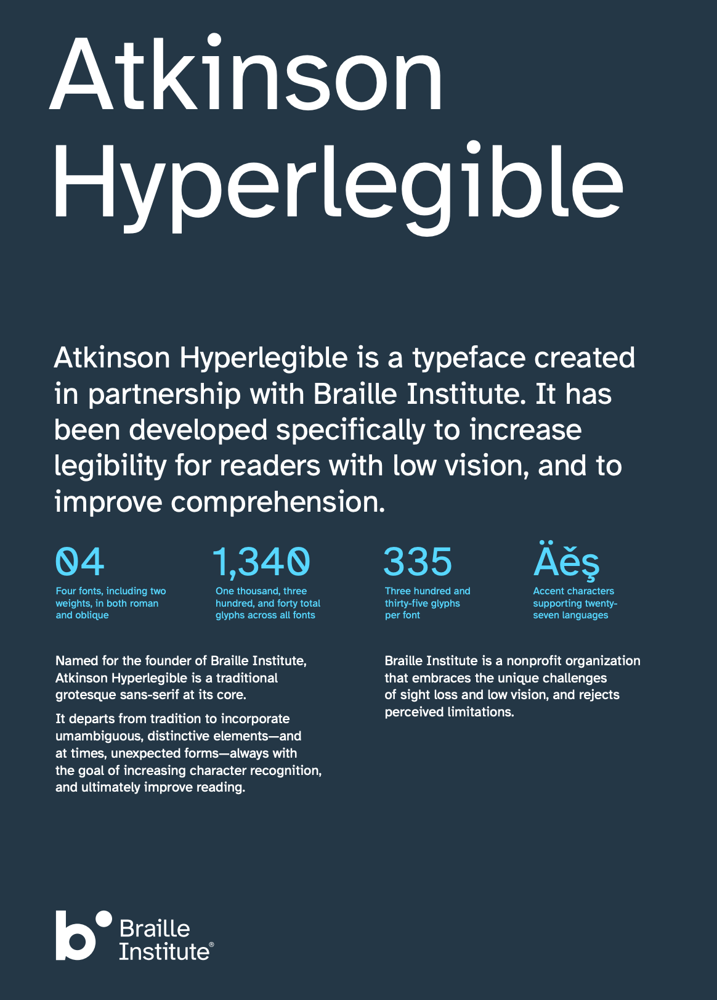

# [Atkinson Hyperlegible]((https://www.brailleinstitute.org/freefont))



## Getting started

Import the font from the CDN:

```html
<link rel="preconnect" href="https://cdn.jsdelivr.net" />
<link
  href="https://cdn.jsdelivr.net/gh/IagoLast/Atkinson@master/Atkinson.css"
  rel="stylesheet"
/>
```

Use the font on your CSS files

```css
* {
  font-family: "Atkinson";
}
```
